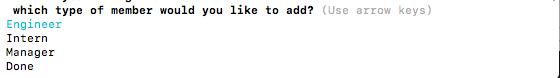
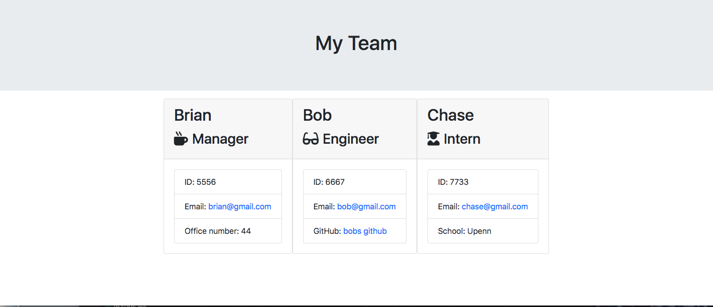
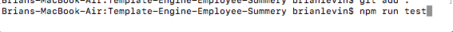
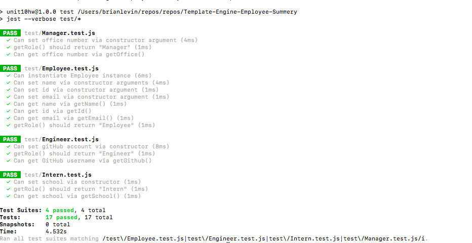

# Template-Engine-Employee-Summery

 We created a modern CLI that takes in information about employees and generates an HTML webpage that displays information for each employee. I also made sure that it pasts all unit tests.  
  
## Click [here](https://drive.google.com/file/d/15jffPtdfOj3spxVYMkrLxlPKhJ8msG7P/view?usp=sharing) for the live app.

This is the prompt to start the application:

 
 
 The first prompt asks for the managers name:
 
 
 
 
 the second prompt asks for the managers id:
 
 
 
 
 the third prompt asks for the mangers email:
 
 
 
 
 the fourth prompt asks for the managers officenumber:
 
 
 
 The command line then gives the user to select another employee or  end the application:
 
  
 
 The engineer would have the same prompts as the manager except the prompt which asks the the engineers github:
 
 
 
 The intern would have the same prompts as the manager except the propmpt which asks for the interns University
 
 
  
 
 When the user is finished, the user will get a command whether new html page has been generated or if there is already an existing team html page:
 

 
 
 The users information will then be displayed on an html page:
 
  
 
 
## Click [here](https://drive.google.com/file/d/1YJE-pKfLD88TKMU1A5n1AaIfIHThwnhL/view?usp=sharing) to view how I ran and past the tests.

Prompt to start the test:

 
 
 Here are the tests results after running the command:
 
 
  

## Libraries and Framework
- Javascript

- Node.js

- NPM

- Inquirer

- Jest

- FS

- Path

## Process

- Used pre written Html and  Javascript   to get started.
- Created the different employee classes.
- Downloaded the npm package.
- Created functions to  run each constructor class called in the inquirer.
-  Rendered each constructor class information  which was created in the inquirer into an  html page. 

